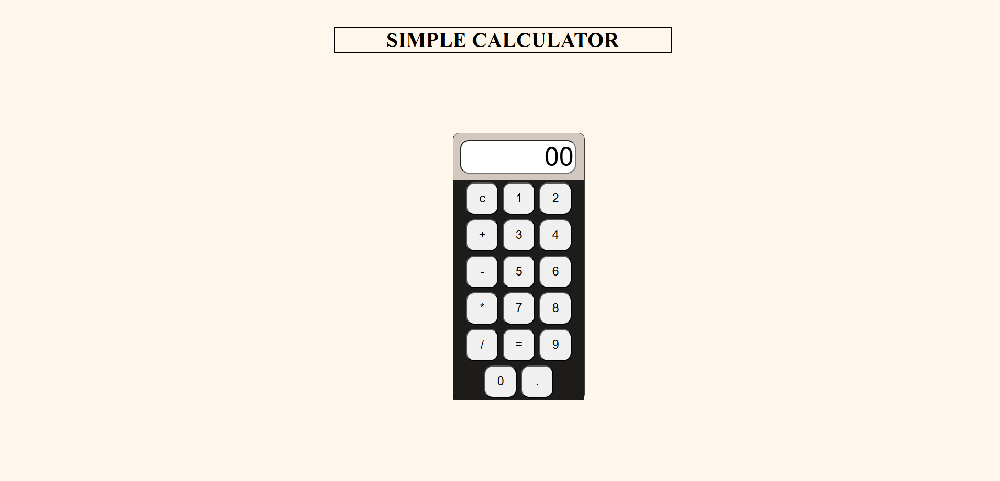

# Simple Calculator

A basic calculator built using **HTML**, **CSS**, and minimal **JavaScript** — built as part of my learning journey in frontend web development.

## 📌 Features

- Addition, subtraction, multiplication, and division
- Clear display button
- Simple UI built with only HTML & CSS
- Single-file implementation with inline JavaScript using  `eval()`

## 🛠️ Technologies Used

- **HTML**
- **CSS**
- **JavaScript** (inline only; no external JS files)

## 🧠 Learning Purpose

This project was made after following a tutorial and adapting it using my own understanding. It helped me grasp:

- HTML structure layout
- CSS styling and positioning
- DOM manipulation via `eval()` function

---

## 📸 Screenshot

---

## 🚀 Live Demo

This project is live here:  
👉 [Live Demo](https://prashant-pal23.github.io/my-first-calculator)

---

## 📄 License

This project is licensed under the [MIT License](LICENSE).

---

## 📬 Connect

If you liked this project, consider starring 🌟 the repo or [connecting with me](https://github.com/Prashant-Pal23)!

---